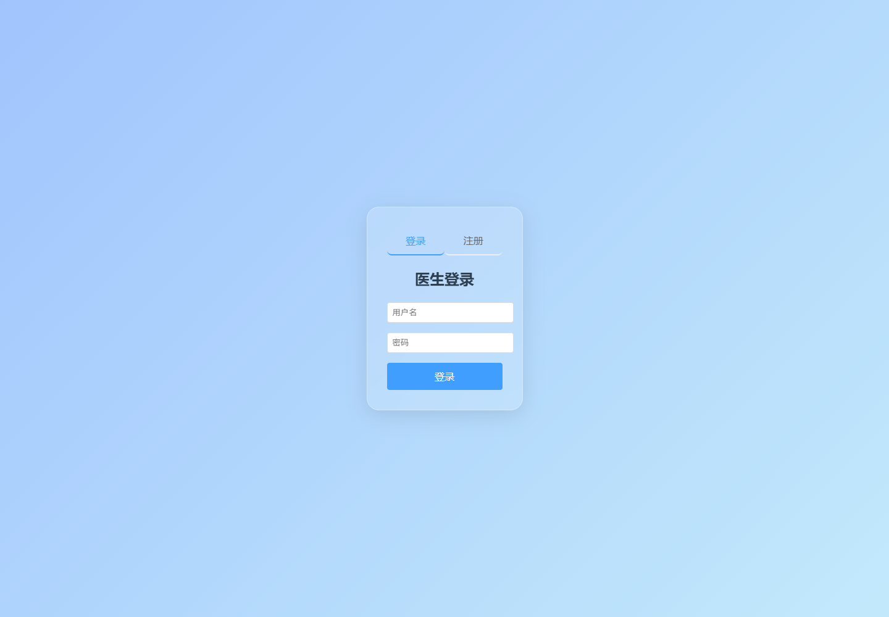
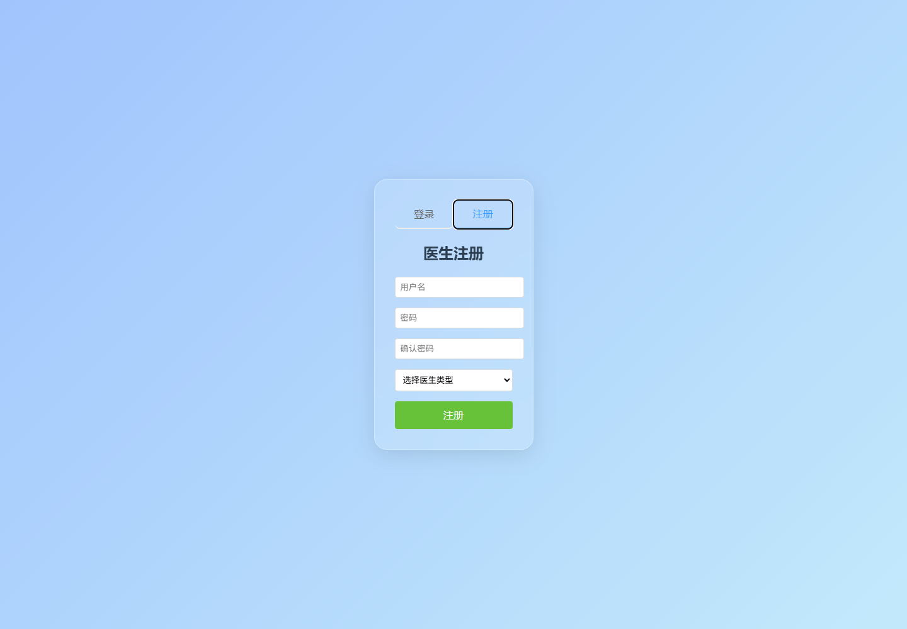

这次运行的是 `his-service`，一个医院信息系统微服务项目。项目后端基于 Spring Cloud Alibaba，前端是 Vue 3 + Vite。后端模块包括挂号支付服务、医生诊疗服务和网关，前端则提供医生登录、注册以及按医生类型进入挂号或问诊页面的入口。



## 项目结构

仓库根目录下主要有四个模块：

- `hospital-common`：公共实体、DTO、VO 等共享代码。
- `registration-payment-service`：挂号与支付服务，默认端口 `8081`。
- `doctor-treatment-service`：医生诊疗服务，默认端口 `8082`。
- `hospital-gateway`：统一 API 网关，默认端口 `9000`。
- `his-ui`：Vue 3 前端项目，通过 Vite 启动。

前端的接口统一走 `/api`，再由 Vite proxy 转发到 `http://localhost:9000`，也就是后端网关。

## 运行环境检查

先检查项目依赖时，发现前端 `node_modules` 已存在，可以直接运行构建和开发服务。后端依赖方面，本机 `3306` 端口可连接，说明 MySQL 服务在运行。初次检查时 `127.0.0.1:8848` 未监听，所以后端微服务链路暂时无法启动；随后启动 Nacos 后，`8848` 端口恢复可连接。

后端首次启动还遇到两个本地编译问题：当前环境使用 Java 25，JDK 23+ 默认不再自动发现注解处理器，导致 Lombok 的 getter、setter 和 builder 没有生成；另外医生诊疗服务里保留了已注释 Seata 事务注解对应的未使用 import，而 Seata 依赖本身已被注释。处理后，后端全量编译通过。

后续跑完整注册/登录流程时，又发现医生服务连接的是 `his_doctor_treatment` 库，但初始化 SQL 中的 `sys_doctor` 表只出现在 `his_registration_payment.sql`。因此医生注册接口第一次调用会报：

```text
Table 'his_doctor_treatment.sys_doctor' doesn't exist
```

为了让本地流程走通，我按已有 `sys_doctor` 表结构在 `his_doctor_treatment` 中补建了同名表。补表后，医生注册和登录接口都可以通过网关正常访问。

## 后端启动

后端全量构建命令：

```bash
.\mvnw.cmd clean install -DskipTests
```

构建通过后，依次启动三个服务：

```bash
.\mvnw.cmd -f registration-payment-service\pom.xml org.springframework.boot:spring-boot-maven-plugin:3.2.5:run
.\mvnw.cmd -f doctor-treatment-service\pom.xml org.springframework.boot:spring-boot-maven-plugin:3.2.5:run
.\mvnw.cmd -f hospital-gateway\pom.xml org.springframework.boot:spring-boot-maven-plugin:3.2.5:run
```

最终监听端口如下：

- `registration-payment-service`：`8081`
- `doctor-treatment-service`：`8082`
- `hospital-gateway`：`9000`

三个服务都成功连接并注册到 Nacos。直连健康检查和网关转发检查均通过：

```text
http://127.0.0.1:8081/actuator/health              -> {"status":"UP"}
http://127.0.0.1:8082/actuator/health              -> {"status":"UP"}
http://127.0.0.1:9000/api/reg/actuator/health      -> {"status":"UP"}
http://127.0.0.1:9000/api/doc/actuator/health      -> {"status":"UP"}
```

## 构建验证

在 `his-ui` 目录执行：

```bash
npm run build
```

构建结果正常，Vite 完成了客户端资源打包，生成了 `dist/index.html`、CSS 和 JS 产物。这一步说明前端源码可以被正常编译。

## 启动前端

开发服务使用固定端口启动：

```bash
npm run dev -- --host 127.0.0.1 --port 5173
```

Vite 启动成功后，本地访问地址为：

```text
http://127.0.0.1:5173/
```

访问 `/login` 后，页面会渲染医生登录卡片，包括“登录 / 注册”切换按钮、用户名输入框、密码输入框和登录按钮。

## Playwright 完整流程截图

使用 Playwright CLI 打开页面并获取页面快照：

```bash
npx --yes --package @playwright/cli playwright-cli open http://127.0.0.1:5173/login
npx --yes --package @playwright/cli playwright-cli resize 1440 1000
npx --yes --package @playwright/cli playwright-cli snapshot
```

快照中可以识别到页面核心元素：

- “医生登录”标题。
- “用户名”输入框。
- “密码”输入框。
- “登录”按钮。

登录页截图：


随后切换到注册 tab，保存注册表单截图：



在注册表单中填入测试账号 `codex_ui_reg_20260704 / 123456`，选择“挂号医生”，点击注册。页面弹出“注册成功，请登录”，说明请求已经从前端经过 Vite proxy、Gateway、医生服务，最终写入 MySQL。

接着使用该挂号医生账号登录。登录成功后，前端根据接口返回的 `type=1` 写入 `localStorage.docType` 并跳转到 `/registration`：


然后退出登录，使用门诊医生账号 `codex_treat_20260704 / 123456` 登录。登录成功后，接口返回 `type=2`，前端跳转到 `/treatment`：


本次 Playwright 操作中，每次页面跳转后都重新执行了 `snapshot`，再使用新的元素 ref 继续操作。退出登录后旧 ref 已失效，Playwright 明确提示需要重新抓取 snapshot；重新抓取后再登录门诊医生，截图才正确落在问诊页面。

## 这次运行的结论

前端部分可以正常构建和运行，登录、注册、挂号角色跳转、问诊角色跳转也都通过 Playwright 完成了截图验证。Nacos 启动并修复本地编译问题后，三个后端服务也已经全部启动，且网关可以正常转发到挂号支付服务和医生诊疗服务。

当前可确认的完整流程是医生注册、医生登录和基于医生类型的前端路由跳转。下一步如果要继续验证真实挂号、支付和诊疗业务，需要补全前端业务页面，并检查 MySQL 中 `his_registration_payment.sql` 与 `his_doctor_treatment.sql` 的表结构是否和各服务实际访问的库保持一致。
