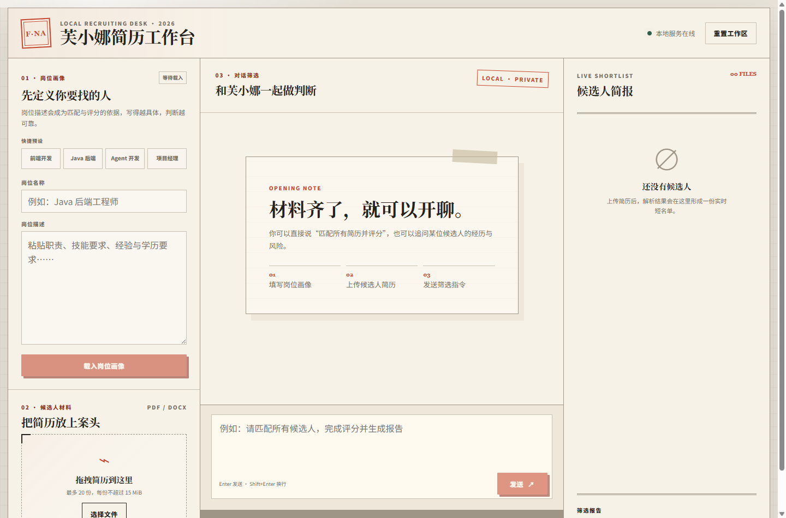
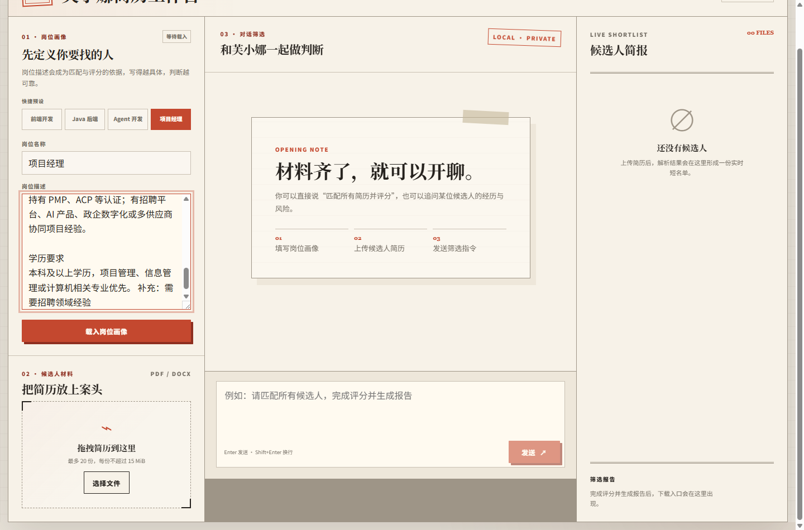
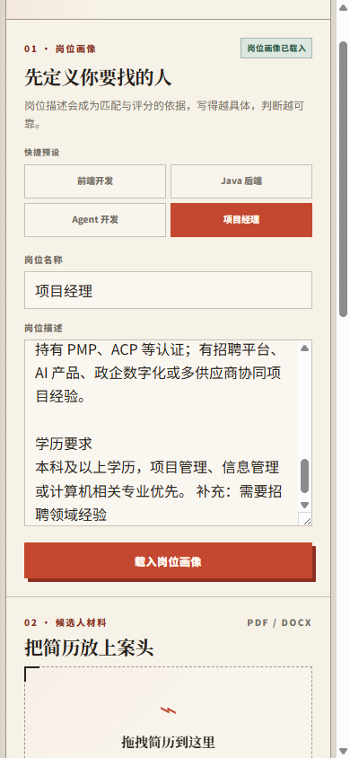

`ResumeAgent` 是一个围绕招聘初筛场景搭建的本地 Agent 工具。它把原本分散在多个步骤里的工作收拢到一个工作台中：先录入岗位 JD，再批量上传 PDF / DOCX 简历，随后由 Agent 完成解析、匹配、评分，并输出 Markdown 格式的筛选报告。

这个项目的目标不是做一个庞杂的 ATS 系统，而是先把“岗位定义清楚、候选人材料收齐、给出结构化判断”这条链路跑通。相较于只停留在命令行或 Prompt Demo 的做法，它更强调可以直接操作、可以复用、也可以持续迭代的本地工具形态。

## 这个版本解决了什么问题

招聘初筛里最耗时的部分，往往不是最终决策，而是前面的信息整理：岗位要求怎么描述、候选人材料如何统一读取、不同候选人与 JD 的比较口径是否一致、最后如何快速形成可分享的书面结论。`ResumeAgent` 把这些动作收敛成一套固定流程，减少了人工在多个文档、聊天窗口和表格之间来回切换的成本。

当前版本聚焦本地单用户使用。JD、候选人和对话状态保存在运行进程中，关闭服务后状态会清空。这是一个有意识的范围控制：先把解析、匹配、评分和报告生成的链路做扎实，再考虑多用户、持久化和权限体系。

## 核心能力

- **岗位画像录入**：支持直接粘贴 JD，也提供前端开发、Java 后端、Agent 开发、项目经理四种预设模板，降低第一次录入成本。
- **简历批量解析**：支持上传 PDF / DOCX 文件，后端用 `pdfplumber` 和 `python-docx` 抽取文本，再交给大模型生成结构化候选人信息。
- **JD 匹配分析**：不是简单关键词命中，而是先让模型分析 JD 的关注重点，再为技能、经验、教育和项目质量分配动态权重。
- **候选人评分**：在匹配结果基础上继续生成分项得分、总分、建议结论和理由，形成更稳定的筛选口径。
- **筛选报告导出**：自动生成 Markdown 报告，包含候选人排名、分项分析和项目经历摘要，适合直接归档或继续人工复审。
- **对话式追问**：在解析和评分之后，可以继续围绕某位候选人追问细节，而不是被固定表单流程限制。

## 页面展示

> 首页采用三栏工作台布局，把岗位录入、对话筛选和候选人短名单并排展开，核心流程一眼可见。

> 左侧区域支持通过预设快速填入岗位画像，再继续人工编辑 JD，兼顾启动效率和可控性。

> 移动端保留了岗位预设、JD 编辑和上传入口，说明这个工作台不只面向桌面宽屏，也考虑了窄屏浏览与操作。

## 技术实现

后端以 Python 为主，核心编排建立在 `LangChain` 的 `create_agent` 之上。项目把 `parse_resume`、`load_jd`、`match_jd`、`score_candidate`、`generate_report` 等动作注册为工具，让模型在多轮对话里调用明确的业务能力，而不是把所有逻辑都塞进一段大 Prompt 里。

简历解析阶段先完成文件文本提取，再要求模型按固定 JSON 结构返回候选人姓名、学历、年限、技能、工作经历和项目经历。这样后续的匹配、评分和报告生成都建立在结构化数据上，而不是建立在不稳定的自然语言段落上。

匹配阶段的重点是“先理解 JD，再比较候选人”。项目没有把权重写死，而是要求模型根据 JD 自身的重心，为技能匹配、工作经验、教育背景和项目质量动态分配百分比。评分阶段继续沿用这组权重，输出总分、分项得分和推荐结论，使整个判断链路前后统一。

为了让这套能力可以直接使用，项目又补了一层 FastAPI Web 服务。服务层负责暴露 `/api/chat`、`/api/jd`、`/api/resumes`、`/api/report` 和 `/api/reset` 等接口，并通过 `WebApplicationService` 持有单例 Agent、管理上传文件目录、限制报告下载路径、处理重置和清理逻辑。

前端使用 `React 19 + TypeScript + Vite` 实现，界面组织成岗位面板、上传区、聊天区和候选人侧栏四个部分。这样的拆分比较符合真实使用顺序：先定义岗位，再导入材料，接着发出筛选指令，最后查看候选人结果与报告下载入口。

## 工程亮点

- **本地优先**：工具定位很明确，先解决本机可用、流程闭环和信息隐私问题，而不是一开始就引入账号体系、数据库和云端依赖。
- **结构化输出链路**：从简历解析到 JD 匹配、再到候选人评分，几个阶段都通过 JSON 结果衔接，便于复用和调试。
- **安全边界意识**：报告下载会校验目标文件必须位于 `output` 目录下，避免任意文件暴露；上传失败时也会清理临时文件。
- **可验证性**：仓库内已经包含 FastAPI API 测试、服务层测试和前端 Vitest 测试，不是只做了一个能演示的界面。
- **演示数据完整**：项目自带示例简历和岗位预设，便于快速复现“导入材料 -> 匹配评分 -> 导出报告”的完整体验。

## 这个项目体现的能力

这个项目最有价值的地方，不只是“接了一个大模型”，而是把一个容易停留在概念层的 Agent 场景，真正压成了可操作的产品原型。它同时涉及 Prompt 设计、工具编排、结构化数据建模、Web API 封装、前端交互组织和自动化测试，比较完整地体现了我把 AI 能力落到具体业务流程中的工程化能力。

如果后续继续扩展，这个项目也有很清晰的演进方向：增加持久化存储、支持多职位并行管理、引入更细粒度的评分解释、补充人工复核工作流，以及把单机工作台继续演进成团队协作工具。
